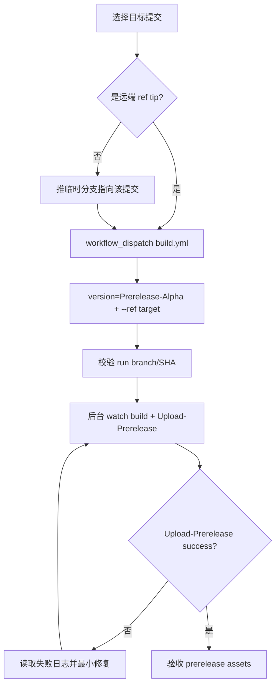

# Prerelease — mihomo

## 边界

- **不要为 Prerelease-Alpha 新建 `v*` tag**；`v*` tag 会走普通 release。
- 正确入口：`build.yml` 的 `workflow_dispatch`，参数 `version=Prerelease-Alpha`。
- `--ref` 必须精确指向包含目标提交的远端 ref tip；目标提交不是任何远端 ref 的 tip 时，先推临时分支。

## 流程



## 必跑步骤

### 1. 确认目标 ref

```bash
git branch --show-current
git rev-parse HEAD
git branch -r --contains <COMMIT_SHA>
```

- 目标提交必须是 `--ref` 指向的远端 ref 当前 tip。
- 若不是，先推临时分支：

```bash
git branch prerelease/<topic> <COMMIT_SHA>
git push -u origin prerelease/<topic>
```

### 2. 触发 workflow

```bash
gh workflow run build.yml \
  -R iuin8/mihomo \
  --ref <branch-or-temp-ref> \
  -f version=Prerelease-Alpha
```

### 3. 校验 run 对应正确代码

```bash
gh run list -R iuin8/mihomo --workflow build.yml --limit 5 \
  --json databaseId,event,headBranch,headSha,status,conclusion,displayTitle

gh run view <RUN_ID> -R iuin8/mihomo \
  --json status,conclusion,jobs,headBranch,headSha,event,url
```

必须满足：

- `event == workflow_dispatch`
- `headBranch == <目标 ref>`
- `headSha == <目标提交>`

### 4. 等待和监控

```bash
gh run watch <RUN_ID> -R iuin8/mihomo --interval 60 --exit-status
```

重点 job：

- `build (...)` 全部成功。
- `Upload-Prerelease == success`。
- `Upload-Release == skipped`；若它成功，说明走错普通 release 流程。

### 5. 验收 Prerelease-Alpha

```bash
gh release view Prerelease-Alpha -R iuin8/mihomo \
  --json isDraft,isPrerelease,tagName,name,assets,url,targetCommitish
```

验收标准：

| 字段 | 期望 |
| --- | --- |
| `isDraft` | `false` |
| `isPrerelease` | `true` |
| `tagName` | `Prerelease-Alpha` |
| assets | 至少包含 darwin-arm64、linux-amd64-v3、linux-arm64、windows-amd64、`checksums.txt`、`version.txt` |

`targetCommitish` 可能显示默认分支；以本次 workflow run 的 `headBranch` / `headSha` 为主验收依据。

## 失败诊断不变量

- 失败必须引用具体 job、step、原始错误片段；不要只按 job 名猜。
- run 未完成时，`gh run view --log-failed` 可能不可用；先定位失败 job/step。
- run 完成后再用：

```bash
gh run view <RUN_ID> -R iuin8/mihomo --log-failed
gh run view <RUN_ID> -R iuin8/mihomo --job <JOB_ID> --log
gh api repos/iuin8/mihomo/actions/jobs/<JOB_ID>/logs > job.log
```

优先看：`Delete current release assets`、`Tag Repo`、`Upload Prerelease`、各平台 build job。

## Red Flags

| 错误动作 | 修正 |
| --- | --- |
| 推 `v*` tag | 这是普通 release；改用 `workflow_dispatch -f version=Prerelease-Alpha` |
| 不带 `--ref` | 会跑默认分支；重新用目标分支触发 |
| 手动 `git tag Prerelease-Alpha` | 不要手动 tag；让 `Upload-Prerelease` 更新 release/tag |
| 目标提交不是远端 ref tip | 先推临时分支，再用该分支 `--ref` |

## 汇报模板

```text
✅ Prerelease-Alpha 已刷新
- workflow: build.yml (workflow_dispatch)
- ref/headSha: <branch> / <sha>
- Upload-Prerelease: success
- assets: <count>
- release: https://github.com/iuin8/mihomo/releases/tag/Prerelease-Alpha
```
