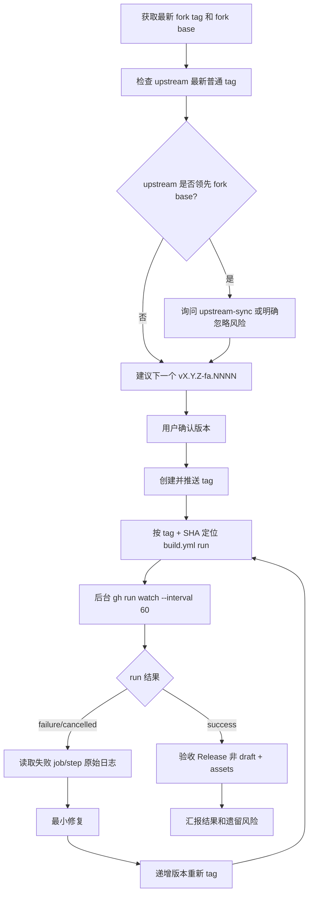

# Release — mihomo

## 边界

- 本 skill 只负责普通 release：`v{upstream_version}-fa.{increment}` tag → `build.yml` → `Upload-Release`。
- `Prerelease-Alpha`、刷新 Alpha 预览版走 `prerelease` skill；不要新建 `v*` tag。
- 若 upstream 已有新普通 tag，默认暂停并转 upstream-sync；用户明确忽略时，确认和最终汇报都要标注风险。
- 外部发布、删除 tag、force overwrite 都属于 public surface；工具被拦时让用户执行，不要绕过。

## 流程



## 必跑步骤

### 1. 版本和 upstream gate

```bash
git fetch origin --tags --force
git fetch upstream --tags --force

LATEST_TAG=$(git tag --sort=-version:refname | grep -E '^v[0-9]+\.[0-9]+\.[0-9]+-fa\.[0-9]+$' | head -1)
FORK_BASE=$(printf '%s\n' "$LATEST_TAG" | sed -E 's/^(v[0-9]+\.[0-9]+\.[0-9]+)-fa\.[0-9]+$/\1/')
UPSTREAM_LATEST=$(git tag --sort=-version:refname | grep -E '^v[0-9]+\.[0-9]+\.[0-9]+$' | head -1)
```

- 若 `UPSTREAM_LATEST` > `FORK_BASE`：询问用户 `先 upstream-sync（推荐）` / `忽略并继续`。
- 忽略继续时，在确认和最终汇报写明：`⚠️ 基于 {FORK_BASE}，upstream {UPSTREAM_LATEST} 尚未合并`。

### 2. 建议版本

- 同一 upstream base：递增 4 位数，如 `v1.19.23-fa.1015` → `v1.19.23-fa.1016`。
- 新 upstream base：从 `fa.1001` 开始。
- 用户确认后创建并推送 tag：

```bash
TAG=v1.19.23-fa.1016
git tag "$TAG"
git push origin "$TAG"
```

### 3. 定位本次 run

必须用 tag + tag SHA 精确定位；不要拿最近一个 push run，因为 `Alpha` 分支也会触发 workflow。

```bash
TAG=v1.19.23-fa.1016
TAG_SHA=$(git rev-list -n 1 "$TAG")

RUN_ID=$(gh run list \
  -R iuin8/mihomo \
  --workflow=build.yml \
  --limit=20 \
  --json databaseId,headBranch,headSha,event,displayTitle \
  --jq 'map(select(.event == "push" and .headBranch == '"\"$TAG\""' and .headSha == '"\"$TAG_SHA\""')) | .[0].databaseId')

gh run view "$RUN_ID" -R iuin8/mihomo --json status,conclusion,jobs \
  --jq '{status,conclusion,jobs:[.jobs[]|{name,status,conclusion}]}'
```

### 4. 等待方式

- 先做一次状态快照。
- 若 `queued` / `in_progress`，用后台任务等待：

```bash
gh run watch "$RUN_ID" -R iuin8/mihomo --interval 60 --exit-status
```

- 不要每 30 秒重复 `gh run view`；只在阶段变化时汇报。
- 等待超过 5 分钟不是失败；做一次快照说明当前 job/step，并继续等待或让用户决定。

### 5. 验收

```bash
gh release view "$TAG" -R iuin8/mihomo --json isDraft,assets,url \
  --jq '{isDraft,assetCount:(.assets|length),assetNames:[.assets[].name],url}'
```

验收标准：

- `isDraft == false`
- assets 覆盖本 fork 预期平台；普通 release 至少要有 darwin-arm64、linux-amd64-v3、linux-arm64、windows-amd64。

## 失败诊断不变量

- 失败必须引用具体 job、step、原始错误片段；不要只按 job 名猜。
- run 未完成时，`gh run view --log-failed` 可能不可用；先用 jobs JSON 或 jobs API 定位失败 step。
- run 完成后再用：

```bash
gh run view "$RUN_ID" -R iuin8/mihomo --log-failed
gh run view "$RUN_ID" -R iuin8/mihomo --job <JOB_ID> --log
gh api repos/iuin8/mihomo/actions/jobs/<JOB_ID>/logs > job.log
```

- Windows runner 默认 shell 是 PowerShell；跨平台 step 里不要写裸 `export`。需要 bash 时显式 `shell: bash`，或独立 bash step 写 `$GITHUB_ENV`。
- `$GITHUB_ENV` 只影响后续 step，不影响同一 step 后续命令。
- 修复后递增新版本重发，最多 3 次；第 3 次仍失败时停止并输出诊断摘要。
- CI patch 逻辑改动后，发布前检查 `.github/patch/` 与 workflow 引用一致。

## 相关文件

- `.github/workflows/build.yml`
- `.github/workflows/test.yml`
- `.github/patch/`
- `.claude/skills/upstream-sync/SKILL.md`
- `.claude/skills/prerelease/SKILL.md`
