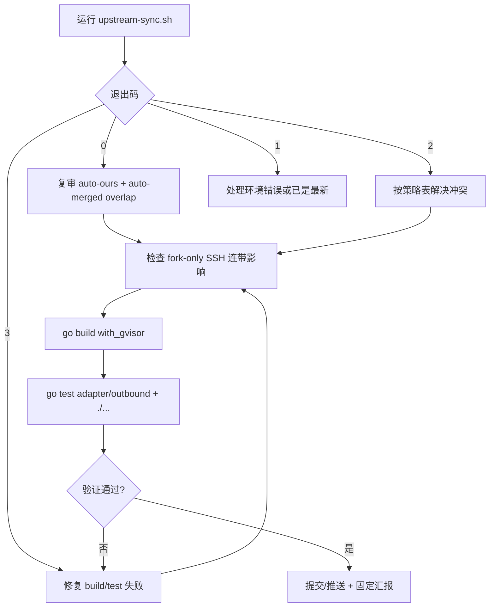

# Upstream Sync — mihomo

## 边界

- 上游：`MetaCubeX/mihomo`；fork：`iuin8/mihomo`。
- 目标分支命名：`fa/<TARGET_TAG>-fa.0`。
- 核心策略：脚本自动 `--ours` 是起点，不是终点；每个自动处理文件都要复审上游 delta。
- fork-only 主要是 **SSH system proxy**；sudoku / trusttunnel 已 upstream-maintained，不按 fork-only 处理。

## 流程



## 必跑步骤

### 1. 运行脚本

```bash
./.claude/skills/upstream-sync/upstream-sync.sh
```

退出码含义：

- `0`：脚本已自动 commit；仍要复审自动处理文件和 overlap。
- `2`：有 `SMART_MERGE_REQUIRED`；按策略表解决冲突。
- `3`：构建失败；修复后重新验证。
- `1`：环境错误 / 已最新；读 stderr 后处理。

### 2. 复审 delta

以脚本 `AI_HINTS` 的 `PREV_TAG` / `TARGET_TAG` 为准；缺失时再查上次 `merge upstream` commit。

```bash
for f in .github/workflows/build.yml .github/workflows/test.yml component/updater/update_core.go <conflict/overlap files>; do
  echo "=== $f ==="
  git log --oneline "$PREV_TAG".."$TARGET_TAG" -- "$f"
  git diff "$PREV_TAG".."$TARGET_TAG" -- "$f"
done
```

### 3. 文件策略

| 文件 / 类别 | 默认 | 必查点 |
| --- | --- | --- |
| `.github/workflows/build.yml` / `test.yml` | 保留 fork 精简 CI | 吸收上游 Go 版本、权限、patch 引用、构建参数修复；确认 `.github/patch/` 静态引用存在 |
| `component/updater/update_core.go` | 保留 fork 下载 URL | 吸收上游 updater bug fix / 安全修复 |
| `adapter/outbound/ssh.go` | 智能合并 | 保留 `socksExt`、`systemSocks`、`useSystemSsh`、`closed`、`UseSshConfigAlias`、`UseSystemSocks`、`SshUser`、`SshFlags` |
| `adapter/outbound/ssh_system*.go` / `ssh_resilience.go` | fork-only | 检查上游包名、函数签名、字段变化造成的间接编译影响 |
| sudoku / trusttunnel | upstream-maintained | 不当作 fork-only；跟随上游 |
| 自动合并成功但双方改过 | 不可默认通过 | 查上游 delta 与 fork-only 调用方是否兼容 |
| 其他上游文件 | 跟随上游 | build/test 兜底 |

冲突文件必须读三份上下文：

```bash
cat <file>
git diff "$PREV_TAG".."$TARGET_TAG" -- <file>
git diff upstream/Alpha...HEAD -- <file>
```

### 4. 验证

```bash
go build -tags with_gvisor -trimpath -ldflags '-w -s' ./...
go test ./adapter/outbound/... -timeout 60s
go test ./... -timeout 180s
```

失败诊断：

- 上游切换第三方包（如 ssh 包）→ 同步 fork-only 文件 import / 类型。
- 上游改函数签名 / 字段 → 改 fork-only 调用方。
- 上游新增依赖 → 检查 `go.mod` / `go.sum`，必要时 `go mod tidy`。
- patch step 失败 → 检查 workflow 引用的 `.github/patch/*.patch` 是否存在。

### 5. 提交 / 推送 / 汇报

```bash
git log --oneline -8
git push -u origin fa/<TARGET_TAG>-fa.0
```

最终汇报只进对话，不落盘，按 6 句组织：

1. 自动 `--ours` 文件复审结论。
2. 智能合并文件的上游意图、fork 意图、融合策略。
3. 自动合并但有连带影响的文件和修复。
4. 验证命令和结果。
5. 推送 short SHA。
6. `NEEDS_USER_REVIEW` 与非阻塞异步事项。

## Red Flags

- “脚本退出码 0 = 完成”——错，仍需复审和验证。
- “git 没冲突 = 文件没问题”——错，fork-only SSH 文件可能编译期才炸。
- “fork 文件一律 ours”——错，上游安全/bug fix 必须吸收。
- “go build 过 = 完成”——错，还要跑目标包测试和全量测试。
- “sudoku/trusttunnel 是 fork-only”——错，它们已 upstream-maintained。
